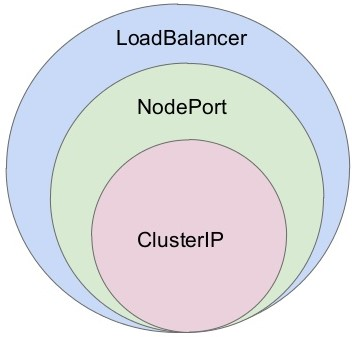

# Co to jest Kubernetes?
Jest to open-source platforma do zarządzania (orkiestrowania) kontenerami (zazwyczaj Dockerowymi). Zarządza cyklem życia i komunikacją pomiędzy kontenerami. Dzięki temu nie musimy się obawiać o sytuację jak aplikacji przestanie działać.

# Komponenty

## Cluster
To zestaw węzłów (node'ów), w których działają aplikacje umieszczone w kontenerach. Klastry umożliwia łatwiejsze tworzenie, przenoszenie i zarządzanie aplikacjami. Klastry umożliwiają działanie kontenerów na wielu maszynach i środowiskach: wirtualnych, fizycznych, w chmurze i lokalnych. Klastry składają się z jednego węzła głównego i wielu węzłów roboczych. Te węzły mogą być komputerami fizycznymi lub maszynami wirtualnymi, w zależności od klastra.

## Node
Węzeł może być maszyną wirtualną lub fizyczną, w zależności od klastra.
Wyrówżniamy dwa typu węzłów:
- główny (*master*) -  zawiera wszystkie usługi *control plane* wymagane do uruchomienia klastra. Zazwyczaj węzeł główny obsługuje tylko dostęp do zarządzania i nie uruchamia żadnych aplikacji kontenerowych.
- robczy (*worker*) - są używane do uruchamiania podów.

## Pod
Pod to mała i proste jednostka, która działa jako pojedyncza instancja aplikacji. Może pomieścić jeden kontener lub wiele kontenerów. Zazwyczaj pod zawiera jeden kontener.

## Depolyment
Służy do definiowania sposobu wdrażania podów: jakiego obrazu powinny używać, liczby uruchomionych replik, zużywanych zasobów, sposobu wdrożenia nowej wersji itp. Reprezentują pożądany stan klastra.

### Sondy (*probe*)
#### Startup
Służy to wykrywania czy aplikacja jest uruchomiona. Jeśli tylko zostanie zwrócny sukces, to Kubernetes zaczyna używać liveness to zidentyfikowania czy aplikacja żyje.

Jest to pierwszy probe, który jest uruchamiany. Kiedy aplikacja startuje może być potrzeba wykonania dużej ilości pracy. Podczas tego procesu, aplikacja nie powinna przyjmować zapyta. Kiedy tylko aplikacja wystartuje i startup probe zwróci sukces, to już więcej nie wywołuje ten sondy. Jeśli startup nigdy nie zwróci sukcesu, to Kubernetes ubija kontener i podlega polityce restartu poda.

##### Przykład
```yaml
apiVersion: apps/v1
kind: Deployment
metadata:
  name: test-app-api-deployment
spec:
  template:
    metadata:
      labels:
        app: test-app-api
    spec:
      containers:
      - name: test-app-api
        image: andrewlock/my-test-api:0.1.1
        startupProbe:
          httpGet:
            path: /health/startup
            port: 80
          failureThreshold: 30
          periodSeconds: 10
```
Sonda jest zdefiniowana w `startupProbe` i wywołuje adres URL `/health/startup` na porcie `80`. Sonda powinna zostać wypróbowana 30 razy przed niepowodzeniem, z 10-sekundowym okresem oczekiwania pomiędzy sprawdzaniami. W tym przykładzie, maksymalny czas oczekiwania na uruchomienie się kontenera to 300 sekund.

#### Livness
Słłuży do wykrywania czy aplikacja działa. Jeśli zwróci błąd, to Kubernester zatrzyma kontener i stworzy nowy.

##### Przykład
```yaml
apiVersion: apps/v1
kind: Deployment
metadata:
  name: test-app-api-deployment
spec:
  template:
    metadata:
      labels:
        app: test-app-api
    spec:
      containers:
      - name: test-app-api
        image: andrewlock/my-test-api:0.1.1
        livenessProbe:
          httpGet:
            path: /healthz
            port: 80
          initialDelaySeconds: 0
          periodSeconds: 10
          timeoutSeconds: 1
          failureThreshold: 3
```
Sonda jest zdefiniowana w `livenessProbe` i wywołuje adres URL `/healthz` na porcie `80`. 

#### Readiness
Służy do wykrywania czy aplikacja jest gotowa do przyjmowania zapytań. Jeśli zwróci błąd, to Kubernetes zostawi działający kontener, ale nie będzie wysyłał do niego zapytań.

##### Przykład
```yaml
apiVersion: apps/v1
kind: Deployment
metadata:
  name: test-app-api-deployment
spec:
  template:
    metadata:
      labels:
        app: test-app-api
    spec:
      containers:
      - name: test-app-api
        image: andrewlock/my-test-api:0.1.1
        readinessProbe:
          httpGet:
            path: /ready
            port: 80
          successThreshold: 3
```
Sonda jest zdefiniowana w `redinessProbe` i wywołuje adres URL `/ready` na porcie `80`. 

#### Konfiguracja
- `initialDelaySeconds`- liczba sekund po uruchomieniu kontenera przed zainicjowaniem sond. Domyślnie 0 sekund. Minimalna wartość to 0. 
- `periodSeconds`- jak często (w sekundach) przeprowadzać sondowanie. Domyślnie 10 sekund. Minimalna wartość to 1. 
- `timeoutSeconds`- liczba sekund, po których następuje timeout. Domyślnie 1 sekunda. Minimalna wartość to 1. 
- `successThreshold`- minimalna liczba kolejnych sukcesów, aby sonda została uznana za udaną po niepowodzeniu. Wartością domyślną jest 1. Musi być 1 dla liveness i startup. Minimalna wartość to 1. 
- `failureThreshold`- gdy sonda nie powiedzie się, Kubernetes spróbuje tyle razy przed poddaniem się. Domyślnie 3. Minimalna wartość to 1.

#### Cykl sond


> Zazwyczaj sondowanie odbywa się przy pomocy HTTP. Jeśli endpoint zwraca kod od 200 do 399, to jest sukces. Cokolwiek innego jest traktowane jako błąd. Jest możliwość na używanie również TCP czy gRPC.

#### Jak używac sond?
1. Używaj smart startup- sprawdzanie czy są gotowe połączenia do bazy/kolejki czy wszystkie zadania do uruchomienia aplikacji zakończyły się
1. Używaj dumb liveness- sprawdzenie powinno być szybkie, bo jest często wywoływane.
1. Używaj smart/dumb readiness- sprawdzenie powinno być w miarę szybkie, przykładowo czy nadal istnieje połaczenie do bazy/kolejki.

## Service
Opisuje sposób komunikacji pomiędzy podami.

### ClusterIP
Daje dostęp do serwisu wewnątrz klastra.

### NodePort
Daje dostęp do node po wyspecyfikowanym porcie i następnie przekierowywuje to do portu serwisu.

### LoadBalancer
Daje dostęp do serwisu z zewnątrz. 



## Ingress
Eksponuje HTTP i HTTPS z zewnątrz klastra do serwisów wewnątrz klastra. Działa jako reverse proxy usług, równoważąc żądania między różnymi usługami działającymi na różnych węzłach.